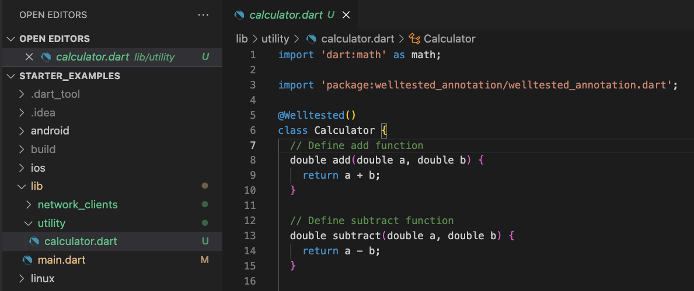
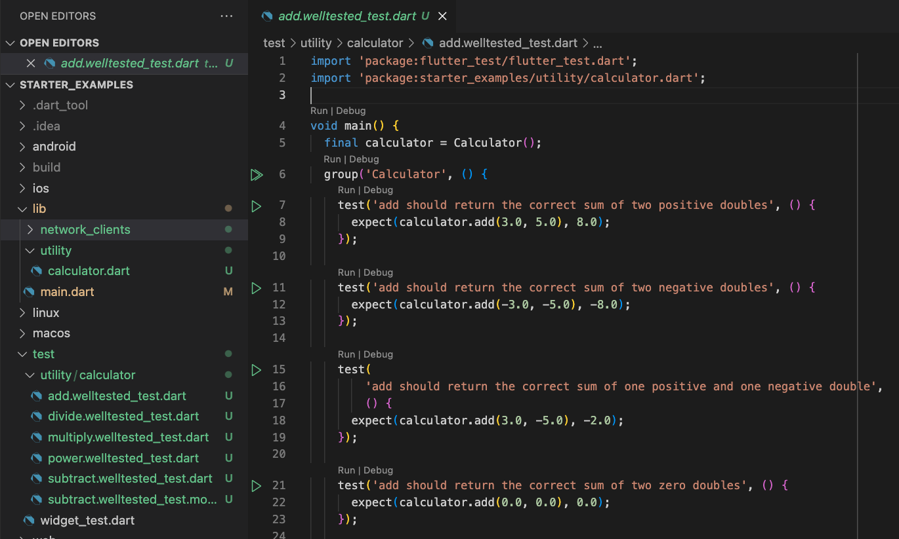
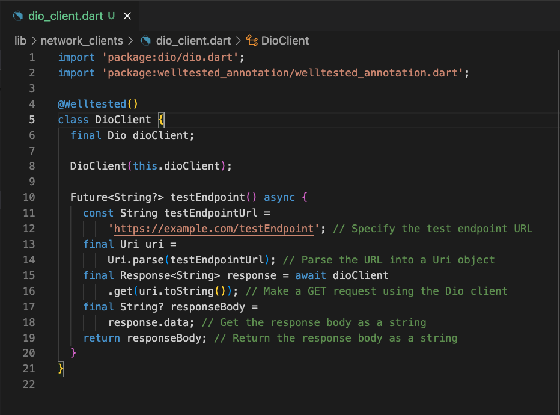
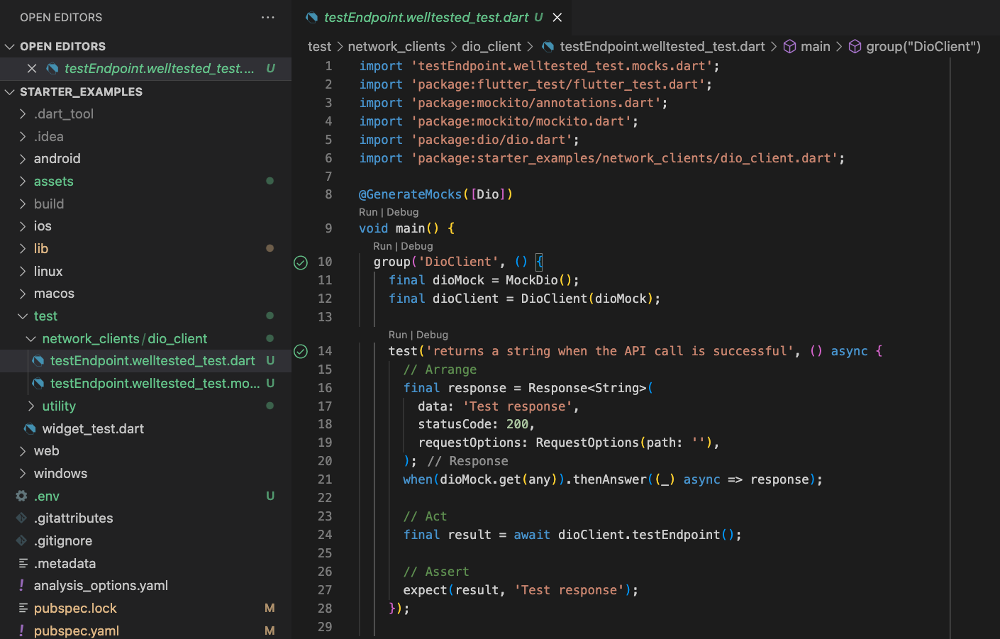

# starter_examples

Curated examples to try out unit test generation with welltested.

The repository consists of following types of examples:

##### 1. Basic
No external dependencies and hence no mocking required.
- [`lib/utility/calculator.dart`](lib/utility/calculator.dart) - Basic arithmetic operations .
##### 2. With External Dependencies
External dependencies need to be mocked and simulated.
- [`lib/network_clients/dio_client.dart`](lib/network_clients/dio_client.dart): Network request with Dio Client mocked.

### To Get Started.

1. First, activate the cli using `dart pub global activate welltested`.
2. In the root of your project, do a `welltested init` and insert your API Key.

### Steps to generate test (Basic).

1. Annotate `Calculator` with @Welltested

2. Run the command: `welltested generate unit`

### Steps to generate test (With External Dependencies).

1. Annotate `DioClient` with @Welltested

2. Run the command: `welltested generate unit`

